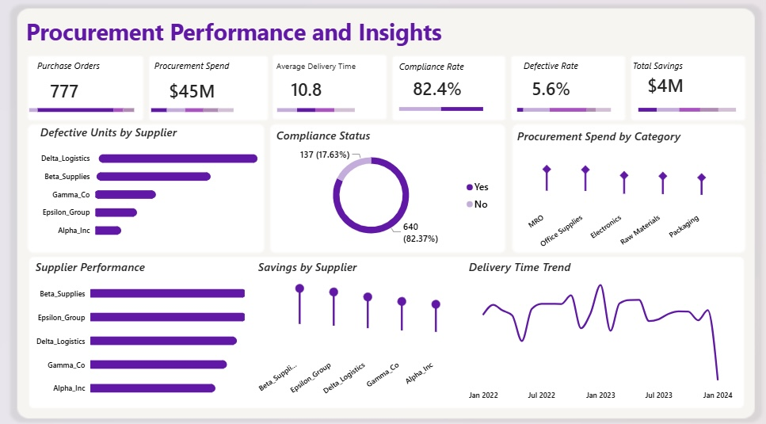
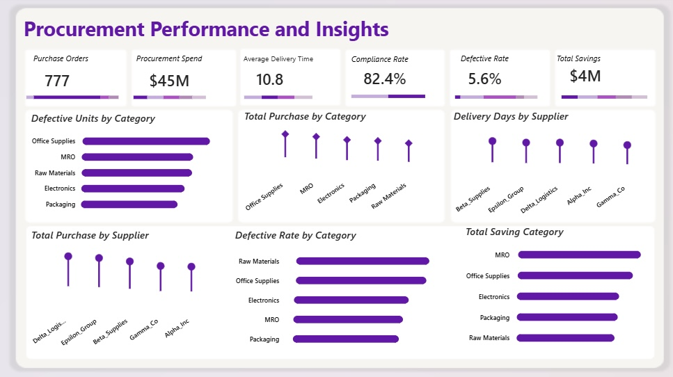

## Procurement Performance and Insights

### Table of Content 
 - [Projects Overview](#project-overview)
 - [Project Objectives](#project-objectives)
 - [Tools](#tools) 
 - [Data Workflow](#data-workflow) 
 - [Key Metrics](#key-metrics)
 - [Data Cleaning and Transformation](#data-cleaning-and-transformation)
 - [Exploratory Data Analysis](#eploratory-data-analysis)
 - [Key Insights and Visuals](#key-insights-and-visuals)
 - [Recommendations](#recommendation)
 - [Assumptions](#assumptions)
 - [Limitations](#limitations)
 - [Author](#author)

### Project overview 

 - This procurement analysis examines purchasing activity to provide a clear view of spending, supplier performance, delivery efficiency, quality, compliance, and cost savings.
Got a hold on this procurement data from Kaggle, the project breaks down purchase orders, suppliers, item categories, quantities, pricing, delivery dates, defective units, and compliance status. The data preparation and querying were handled using SQL, and the findings were brought to life through an interactive Power BI dashboard designed for ongoing performance monitoring.
Ultimately, the analysis uncovers spending patterns across different suppliers and categories, tracks delivery reliability, audits compliance, measures defect rates, and calculates total procurement savings.

### Project Objectives 

 - Examining procurement activity across various suppliers and item categories
 - Calculating total procurement spend and tracking spending distribution by category
 - Evaluating supplier delivery performance and uncovering trends over time
 - Assessing overall procurement compliance
 - Identifying specific suppliers and categories driving high defective units and defect rates
 - Measuring procurement savings across different suppliers and categories
 - Delivering actionable insights to optimize both purchasing strategy and supplier manage

### Tools

 - PostgreSQL 
      - Used for data ingestion, data cleaning, transformation, calculated fields, and procurement analysis.

 - Power BI 
      - Used for data visualization, KPI development, dashboard design, and interactive analysis.

### Data Workflow 

 - Source
      - The raw procurement data originates from Kaggle, capturing a complete operational record of purchasing activity. This repository documents every transaction from purchase orders and supplier metrics to product categories, pricing structures, delivery timelines, defect counts, and regulatory compliance.

 - Ingestion 
      - The procurement dataset was imported into PostgreSQL to establish a structured foundation for data preparation, transformation, and analysis. Once the SQL based preparation and analysis were finalized, the processed data was connected to Power BI for dashboard development and visual storytelling.
 
 - Cleaning
      - The dataset underwent a thorough review to identify data quality issues and ensure procurement records were fully prepared for analysis. Key fields required for procurement calculations and performance metrics were systematically checked for missing values and structure.

 - Transformation
      - SQL was used to create calculated fields required for the analysis, including Estimated Total Cost, Actual Total Cost, Saving per Unit, Total Saving, Good Units, and Delivery Days, which made it possible to analyze procurement spending, savings, product quality, and delivery performance.

 - Analysis
      - The SQL analysis focused on purchase volume, procurement spending, supplier performance, category spending, delivery performance, compliance, defective units, defective rates, procurement savings, and delivery trends, with queries used to aggregate and compare procurement data across suppliers, categories, dates, and performance measures.

 - Output
      - The final output was an interactive Power BI Procurement Analysis Dashboard containing KPI cards and visualizations covering procurement spending, supplier performance, delivery, quality, compliance, and savings, while the repository can also contain the SQL script used for the data preparation and analysis, allowing the analytical process to be reviewed separately from the dashboard.

### Key Metrics
 - Total Purchase Orders (777)
      - Indicates the total number of procurement orders analyzed.
 
 - Total Procurement Spend (₦45M)
      - Reflects the total procurement expenditure across the analyzed purchase orders.
 
 - Average Delivery Time (10.8 days)
      - Shows the average time taken for procurement orders to be delivered.
 
 - Compliance Rate (82.4%)
      - The percentage of procurement orders that met the recorded compliance requirements.
 
 - Defective Rate (5.6%)
      - Measures the overall share of defective units within the purchased quantity.
 
 - Total Savings (₦4M)
      - Signifies the total procurement savings achieved through negotiated pricing.
 
 - Total Quantity Purchased (851K units) 
      - Indicates the total quantity procured across the purchase orders.

### Data Cleaning and Transformation

 - Before building the analytical calculations, the procurement dataset was reviewed in SQL to assess its structure, completeness, and consistency, and to prepare it for analysis in Power BI.

 - Dataset overview
      - The dataset contains 777 purchase orders with the following fields: Product ID, Supplier, Order Date, Delivery Date, Item Category, Order Status, Quantity, Unit Price, Negotiated Price, Defective Units, and Compliance.

 - Completeness checks

      - Delivery Date: only 690 of 777 records had a delivery date populated. Since Delivery Days depends on both Order Date and Delivery Date, incomplete records can’t produce a valid delivery duration value.
      - Defective Units: 641 records had values recorded, which was verified before running any quality calculations (defective units, defective rate).
      - Other fields were also checked for missing values as part of the broader review.

 - Duplicate check
      - Records were checked for duplicates to prevent repeated entries from inflating purchase volumes, spend, defective units, or savings figures.

 - Consistency review
       - Supplier names, item categories, order delivery dates, quantities, unit prices, negotiated prices, defective units, and compliance status were reviewed for consistency, ensuring the fields could be grouped and aggregated reliably.

 - Date validation
      - A check for cases where Delivery Date preceded Order Date found one inconsistent record. It was flagged and retained as-is rather than modified, preserving the original data while documenting the issue.
  
 - Calculated Fields
      - After completing the data quality checks, calculated fields were created to support the procurement analysis.

 - Estimated Total Cost
      - Calculated as Quantity × Unit Price. This represents the estimated procurement cost based on the original unit price.

 - Actual Total Cost
      - Calculated as Quantity × Negotiated Price. This represents the procurement cost based on the negotiated price.

 - Saving per Unit
      - Calculated as the difference between the original unit price and the negotiated price. This measures the saving achieved per unit through negotiated pricing.

 - Total Saving
      - Calculated as the difference between the estimated total cost and the actual total cost. This measures the total procurement saving achieved through negotiated pricing.

 - Good Units
      - Calculated as Quantity − Defective Units. This represents the quantity remaining after defective units are deducted.

 - Delivery Days
      - Calculated as Delivery Date − Order Date. This measures the number of days taken to fulfil each procurement order.

 - Aggregation
      - The cleaned and calculated dataset was grouped by Supplier, Item Category, Compliance Status, and Year, and summarized across Delivery Performance, Defective Units, Defective Rate, Procurement Spend, and Savings — preparing it for supplier, category, and time-based comparisons in the Power BI dashboard.

### Exploratory Data Analysis

 - How much is being spent on procurement?

      - Total procurement spend was ₦45M across 777 purchase orders.

 - Which categories account for the highest procurement spending?

      - MRO recorded the highest procurement spend at ₦10.1M, followed by Office Supplies at ₦10.0M.

 - Which suppliers account for the highest procurement spending?

      - Beta Suppliers and Epsilon Group recorded the highest procurement spend at ₦9.9M each.

 - Which categories have the highest purchase volumes?

      - Office Supplies recorded the highest purchase volume at 174, followed by MRO at 164.

 - Which suppliers supplied the highest number of goods?

      - Delta Logistics recorded the highest purchase volume from a supplier at 171, followed by Epsilon Group at 166.

 - Which suppliers have the shortest average delivery times?

      - Gamma_co recorded the shortest average delivery time at 10.19 days, while Bata Suppliers recorded the longest at 11.27 days.

 - Which categories and suppliers recorded the highest defective units?

      - Office Supplies recorded the highest defective units by category at 11K, while Delta Logistics recorded the highest defective units by supplier at 20K.

 - Which category recorded the highest defective rate?

      - Raw Materials recorded the highest defective rate at 6.4%.

 - What is the compliance status of the purchase orders?

      - Out of 777 purchase orders, 640 were compliant and 137 were non compliant.

 - Which categories and suppliers generated the highest savings?

      - MRO generated the highest category savings at ₦902K, while Beta Suppliers generated the highest supplier savings at ₦890K.

### Key insights and visuals 
 
 - Total Purchase by Category

      - Office Supplies leads the pack here, with 174 purchases the most of any category. MRO isn’t far behind at 164, and Electronics comes in third at 152. Packaging and Raw Materials sit close together at 140 and 139. So if you’re looking at where the bulk of procurement activity is happening, it’s Office Supplies.

 - Total Purchase by Supplier

      - Delta Logistics is doing the most business here, supplying 171 orders just ahead of Epsilon Group at 166. Beta Suppliers comes in at 156, with Gamma_co and  Alpha Inc close behind at 143 and 141.

 - Procurement Spend by Category

      - Volume and spend don’t always line up the same way, and that’s true here. MRO takes the top spot for spend at ₦10.1M, with Office Supplies practically tied right behind it at ₦10.0M. Electronics and Raw Materials sit around ₦8.5M to ₦8.6M, and Packaging trails at ₦8.1M. Between the two, MRO and Office Supplies are clearly where most of the money is going.

 - Supplier Performance

      - Beta Suppliers and Epsilon Group are the priciest to work with, each accounting for about ₦9.9M in spend. Delta Logistics follows at ₦9.2M, then Gamma_co at ₦8.6M and Alpha Inc at ₦7.8M.

 - Total Savings by Category

      - MRO isn’t just the biggest spend category it’s also delivering the most savings, at ₦902K through negotiated pricing. Office Supplies follows at ₦844K. Packaging and Raw Materials land around ₦700K to ₦733K, while Electronics lags well behind at just ₦143K.

 - Savings by Supplier

      - Beta Suppliers is getting the best deals on the table, saving ₦890K overall. Epsilon Group is close behind at ₦845K, with Delta Logistics, Gammma_co and Alpha Inc trailing at ₦782K, ₦725K, and ₦689K.

 - Average Delivery Days by Supplier

      - Gamma_co is the fastest supplier by a small but real margin, averaging 10.19 days to deliver. Beta Suppliers is the slowest, at 11.27 days. It’s not a massive gap day to day, but over hundreds of orders it adds up.

 - Defective Units by Category

      - In raw numbers, Office Supplies has the most defective units at 11K. MRO, Raw Materials, and Electronics all sit close together around 10K, and Packaging is a bit lower at 8K.

 - Defective Rate by Category

      - Here’s where the story shifts. Raw Materials actually has the worst defective rate at 6.4%, even though it didn’t have the most defects in absolute terms  because a smaller total quantity purchased means each defect carries more weight. Office Supplies follows at 6.2%, then Electronics (5.4%), MRO (5.2%), and Packaging (5.0%). So while Office Supplies looks worse on paper, Raw Materials is quietly the bigger quality concern once you account for volume.

 - Defective Units by Supplier

      - Delta Logistics stands out here and not in a good way. It recorded 20K defective units, well ahead of Beta Suppliers at 14K. Gamma_co, Epsilon Group, and Alpha Inc are much lower, at 7K, 5K, and 3K.

 - Compliance Status

      - Most of the orders are in good standing 640 out of 777, or about 83%, met the recorded compliance requirements. That leaves 137 orders, or roughly 17.6%, that didn’t, which is worth flagging for follow up.

 - Delivery Time Trend

      - Delivery times were all over the place through 2022 and 2023 starting around 10.4 days in January 2022, climbing to 12.6 days by October, and peaking near 13.8 days in early 2023. Then in 2024, something changed average delivery time dropped to roughly 3 days. That’s a dramatic enough shift that it’s worth investigating rather than assuming it’s simply good news the data alone doesn’t explain what drove it.

### Recommendations

 - Review suppliers with high defective unit
      - Delta Logistics recorded the highest number of defective units at 20K. The procurement team could review the supplier’s quality performance and investigate the factors contributing to the high defect volume.
 
 - Investigate Raw Materials quality
      - Raw Materials recorded the highest defective rate at 6.4%. The business could investigate the quality issues associated with this category and assess whether supplier or product level factors may be contributing to the higher rate.
 
 - Monitor supplier delivery performance 
      - Gamma_co recorded the shortest average delivery time at 10.19 days, while Better Suppliers recorded the longest at 11.27 days. Delivery performance could be monitored regularly to identify suppliers with consistently longer delivery times.
  
 - Review procurement negotiation practices
      - MRO generated the highest category savings at ₦902K, while Beta Suppliers recorded the highest supplier savings at ₦890K. The procurement team could review the pricing and negotiation practices associated with these savings and identify opportunities to apply effective approaches more broadly.
 
 - Investigate the 2024 delivery trend
      - Average delivery time declined from 10.8 days in 2023 to 3.0 days in 2024. The underlying records should be reviewed to understand what caused this change before treating it as a confirmed improvement in supplier performance.

### Assumptions

 - Delivery Days represents the difference between Delivery Date and Order Date.
 
 - Estimated Total Cost is based on Quantity multiplied by Unit Price.
 
 - Actual Total Cost is based on Quantity multiplied by Negotiated Price.
 
 - Total Saving represents the difference between estimated and actual procurement cost.
  
 - Defective Rate is based on defective units relative to total quantity purchased.
 
 - Compliance is based on the Yes and No compliance status recorded in the dataset.
 
 - The 851K total quantity represents the quantity procured rather than products sold.

### Limitations

 - The analysis is based only on the information available in the procurement dataset.

 - The data shows procurement patterns and performance but does not explain the reasons behind them.
 
 - The reason for the significant reduction in delivery time in 2024 was not established in this analysis.
 
 - The analysis identifies defective units and defective rates but does not identify the specific causes of the defects.

 - Compliance results are based on the compliance status recorded in the dataset.

### Author 

      
